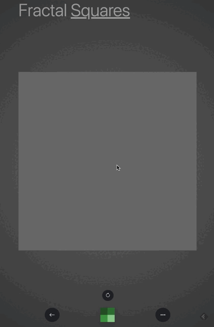

# Fractal-Squares

In Fractal-Squares you can create images by recursively subdividing either squares or triangles and transform into one another.
But, a GIF says more than 1000 words:

Check it out: [Fractal-Squares](https://beluwi.de/apps/fractal-squares/)

## Upcoming Features
- Zoom in and out
- More Colors
- Share per Url (-> Quadtree Encoding)
